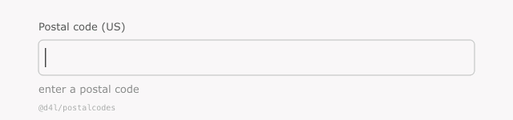

# @d4l/postalcodes

> Offline postal-code validation for every country GeoNames covers — Node,
> browsers, and React Native. Sub-millisecond live validation **as the user
> types**, with no network calls and no API keys.

<p align="center">
  
</p>

[](https://www.npmjs.com/package/@d4l/postalcodes)
[](https://bundlephobia.com/package/@d4l/postalcodes)
[](./dist/index.d.ts)
[](./LICENSE)
[](./ATTRIBUTION.md)

## Why does this exist?

Validating a postal code is one of those small problems that gets nasty fast:

- A regex like `/^\d{5}$/` rejects perfectly valid Canadian (`K1A 0B1`),
  Argentinian (`C1419`), or UK (`SW1A 1AA`) codes.
- Server-side APIs (Google, Smarty, etc.) send your users' addresses over the
  network, cost money, need keys, and break offline.
- Hand-rolled regex libraries are incomplete and go stale — postal authorities
  add codes constantly.

`@d4l/postalcodes` ships the [GeoNames](https://www.geonames.org/) postal-code
dataset as one **gzipped, binary-packed index file per country**, inside the
npm tarball. The runtime is a few kilobytes and never touches the network. A
scheduled GitHub Action refreshes the data and republishes monthly, so your
users see new codes without you lifting a finger.

## 30 seconds

```ts
import { loadCountry } from '@d4l/postalcodes/node';
import { validatePostalCode } from '@d4l/postalcodes';

await loadCountry('US');

validatePostalCode('US', '');         // → valid: false, isPrefix: true,  formatOk: true
validatePostalCode('US', '9');        // → valid: false, isPrefix: true,  formatOk: true
validatePostalCode('US', '902');      // → valid: false, isPrefix: true,  formatOk: true
validatePostalCode('US', '90210');    // → valid: true,  isPrefix: true,  formatOk: true
validatePostalCode('US', '9XYZ0');    // → valid: false, isPrefix: false, formatOk: false
validatePostalCode('US', '99999');    // → valid: false, isPrefix: false, formatOk: true (well-formed but unknown)
```

The `isPrefix` flag is the trick that makes input fields feel right: the field
stays neutral while the user is still typing and only goes red when the input
can no longer become a valid code. No more inputs flickering green-then-red on
every keystroke.

## How it stacks up

|                              | `@d4l/postalcodes`             | regex-based libraries  | online APIs (Google, Smarty, …) |
| ---------------------------- | ------------------------------ | ---------------------- | ------------------------------- |
| Works offline                | yes                            | yes                    | no                              |
| Validates against real codes | yes (GeoNames dataset)         | format only            | yes                             |
| Live "as you type" check     | yes (prefix lookup)            | partial (regex only)   | usually no                      |
| Privacy                      | inputs never leave the device  | inputs never leave     | inputs sent to vendor           |
| Cost                         | free, MIT                      | free                   | paid above free tier            |
| React Native / Hermes        | yes                            | yes                    | only with network               |
| Country coverage             | ~100 (whatever GeoNames ships) | varies                 | ~250                            |
| Stays current                | monthly auto-publish           | manual PRs             | vendor-managed                  |
| API key / signup             | none                           | none                   | required                        |

## When to reach for it

- **Address forms in e-commerce checkouts** — make the field forgiving while the
  user types, but reject typos before they become failed shipments.
- **Patient or customer onboarding** in regulated contexts where postal codes
  must not be sent to a third party.
- **KYC / address-verification UIs** that need to work behind a VPN, in the
  field, or in waiting-room kiosks without reliable connectivity.
- **React Native apps** where bundling means "must work offline by default."
- **Forms in design systems** — drop-in validator with a `ValidationResult`
  that maps cleanly to your existing `idle / pending / valid / error` states.

## Install

```sh
npm install @d4l/postalcodes
```

Node 20+ for the convenience loader. The browser / React Native path has no
Node-version requirement — everything runtime-side runs on ES2022.

## Quick start — Node

```ts
import { loadCountry } from '@d4l/postalcodes/node';
import { validatePostalCode } from '@d4l/postalcodes';

await loadCountry('US');

validatePostalCode('US', '90210');
// → { valid: true, isPrefix: true, formatOk: true, normalized: '90210' }
```

## Quick start — React Native / browser

Metro and modern web bundlers handle JSON imports natively, so the cleanest
pattern is to register each country you care about explicitly. **Only the data
files you import are bundled into your app** — there's no per-country tax for
countries you don't use.

```ts
import US from '@d4l/postalcodes/data/US.json';
import DE from '@d4l/postalcodes/data/DE.json';
import { registerCountry, validatePostalCode } from '@d4l/postalcodes';

registerCountry(US);
registerCountry(DE);

validatePostalCode('DE', '10117').valid; // true (Berlin)
```

There's a complete React Native example in
[`examples/react-native-input.tsx`](./examples/react-native-input.tsx) and a
runnable browser demo in [`examples/web-form.html`](./examples/web-form.html).

## API

### `validatePostalCode(country, raw): ValidationResult`

```ts
interface ValidationResult {
  valid: boolean;     // complete and present in the country's index
  isPrefix: boolean;  // could still grow into a valid code (true when valid is true)
  formatOk: boolean;  // matches per-position char-class (cheap structural check)
  normalized: string; // uppercase, separators stripped
}
```

Input is normalized internally — spaces and hyphens stripped, letters
uppercased — so `validatePostalCode('CA', 'k1a 0b1')` and
`validatePostalCode('CA', 'K1A-0B1')` behave identically.

Throws `UnknownCountryError` if you forgot to register that country.

### Driving an `<input>` field

```ts
function uiState(country: string, raw: string) {
  if (!raw) return 'idle';
  const r = validatePostalCode(country, raw);
  if (r.valid)     return 'valid';      // green
  if (!r.formatOk) return 'invalid';    // red — invalid characters
  if (r.isPrefix)  return 'typing';     // neutral
  return 'invalid';                     // red — well-formed but not a known code
}
```

### Other exports

- `isValidPostalCode(country, raw): boolean` — sugar for `validate(...).valid`
- `isValidPrefix(country, raw): boolean` — sugar for `validate(...).isPrefix`
- `registerCountry(data: CountryData): void`
- `unregisterCountry(code: string): boolean`
- `isCountryLoaded(code: string): boolean`
- `loadedCountries(): string[]`
- `normalizePostalCode(raw: string): string`
- `regexForCountry(code: string): RegExp` — derive a structural regex (handy for `<input pattern>`)

From `@d4l/postalcodes/node` (Node-only convenience):

- `loadCountry(code: string): Promise<boolean>`
- `loadAllCountries(): Promise<string[]>`
- `readManifest(): Promise<Manifest>`

## How it works

For each country we:

1. Parse the GeoNames TSV and keep only `(country_code, postal_code)` pairs.
2. Normalize codes to uppercase ASCII, strip spaces and hyphens, deduplicate.
3. Sort lexicographically and pack:
   - If every code has the same length: concatenate, no per-record overhead.
   - Otherwise: 1-byte length prefix + ASCII bytes per code.
4. Gzip the packed buffer, base64-encode it, wrap in a small JSON record with
   per-position character-class metadata.

At runtime, validation is:

- `O(L)` structural check against the per-position char-class (rejects garbage early)
- `O(log N · L)` binary search over the sorted buffer for exact match and prefix

`N` is the number of codes for the country (US ≈ 42k, DE ≈ 16k); `L` is the
code length. Validation is well under a millisecond in practice.

## Updating the data

A scheduled GitHub Action runs on the 1st of every month, regenerates the
indexes from GeoNames, bumps the patch version, and republishes — so your
`^0.1.0` range automatically picks up new codes. See
[`.github/workflows/update-data.yml`](./.github/workflows/update-data.yml).

To regenerate locally:

```sh
npm run update-data   # downloads allCountries.zip and rebuilds data/
```

## Coverage caveats

The dataset is whatever GeoNames distributes in
[`allCountries.zip`](https://download.geonames.org/export/zip/) — typically
around 100 countries with a mix of full and partial codes. Most notably:

- **Great Britain** ships outward codes only (e.g. `SW1A`), not full PAF
  postcodes. If you need full UK postcode validation, pair this package with a
  PAF-licensed source.
- A handful of small territories may be missing entirely.

Run `await readManifest()` (from `@d4l/postalcodes/node`) to see the exact
country list shipped in your installed version.

## Attribution

Postal-code data © [GeoNames](https://www.geonames.org/),
[CC BY 4.0](https://creativecommons.org/licenses/by/4.0/). When redistributing
the data, keep the attribution intact. See [ATTRIBUTION.md](./ATTRIBUTION.md).

## License

MIT for the code. CC BY 4.0 for the bundled data in `data/`.
